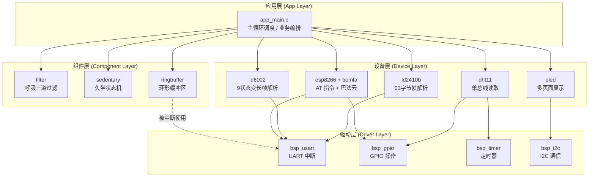

# 软件架构说明

> 本项目采用 **四级分层架构** 组织代码：应用层 / 组件层 / 设备层 / 驱动层。
> 设计目标：高内聚低耦合，更换某个传感器只改设备层，业务逻辑不受影响。

---

## 一、整体架构图



> 📷 **建议截图位置**：用 draw.io 或 ProcessOn 重画一份更精美的版本，导出 PNG 替换。

---

## 二、各层职责详解

### 🔵 应用层 (App Layer)

**职责**：业务编排，调度各设备和组件，实现产品功能。

**文件**：
- `App/app_main.c`：主循环，按节拍轮询各传感器、更新状态机、刷新显示、上报云端

**典型代码示例**：
```c
void App_Main(void)
{
    while (1) {
        // 1. 处理 LD2410B 帧
        if (LD2410B_HasFrame()) {
            LD2410B_State_t state;
            LD2410B_GetState(&state);
            Sedentary_OnTargetState(state.target);
        }

        // 2. 处理 LD6002 帧
        if (LD6002_HasFrame()) {
            float br = LD6002_GetBreathRate();
            float stable = Breath_GetStableValue(br);
            OLED_ShowBreath(stable);
        }

        // 3. 周期上报
        if (uptime_tick % 5000 == 0) {
            Bemfa_PublishAll();
        }

        Delay_ms(10);
    }
}
```

**设计要点**：应用层**不直接操作寄存器**，只调用设备层和组件层的 API。

---

### 🟢 组件层 (Component Layer)

**职责**：可复用的算法模块，**不依赖任何具体硬件**，纯逻辑/数据处理。

**模块清单**：

| 模块 | 文件 | 说明 |
| --- | --- | --- |
| `filter` | `filter.c/.h` | 呼吸频率三道级联过滤（合理范围 + 中位数 + 时间一致性） |
| `sedentary` | `sedentary.c/.h` | 久坐识别四态状态机（IDLE/SITTING/LIGHT/HEAVY） |
| `ringbuffer` | `ringbuffer.c/.h` | SPSC 无锁环形缓冲区，UART 中断与主循环解耦 |

**设计要点**：
- 组件层模块可以被**任何项目复用**——抽出来给别的 STM32 项目用，不用改一行代码
- 不能 `#include` 设备层或驱动层的头文件
- 所有依赖通过函数参数传入

**示例**：呼吸过滤模块完全不知道数据来自哪个雷达
```c
// filter.h
float Filter_MedianFilter5(float new_value);
bool  Filter_RangeCheck(float value, float min, float max);
bool  Filter_TimeConsistency(float new_value, float last_value, float max_delta);
```

---

### 🟡 设备层 (Device Layer)

**职责**：封装具体芯片/模组的驱动逻辑，对上层屏蔽硬件细节。

**模块清单**：

| 模块 | 接口示例 |
| --- | --- |
| `ld2410b` | `LD2410B_Init()` / `LD2410B_ProcessByte()` / `LD2410B_GetState()` |
| `ld6002` | `LD6002_Init()` / `LD6002_Process()` / `LD6002_GetBreathRate()` |
| `dht11` | `DHT11_Init()` / `DHT11_Read(uint8_t *t, uint8_t *h)` |
| `esp8266` | `ESP8266_Init()` / `ESP8266_SendAT()` |
| `bemfa` | `Bemfa_Connect()` / `Bemfa_Publish(topic, payload)` |
| `oled` | `OLED_Init()` / `OLED_ShowString()` / `OLED_DrawIcon()` |

**设计要点**：
- 每个设备一个文件夹，一个 `.c` + 一个 `.h`
- 头文件只暴露**接口**和**必要的类型**，内部状态机变量加 `static`
- 设备层可以调用驱动层（如 USART 发送），但不能调用其他设备层

---

### 🔴 驱动层 (Driver Layer / BSP)

**职责**：板级支持包 (Board Support Package)，封装 STM32 外设的初始化和基本操作。

**文件**：
- `Driver/bsp_usart.c/.h` — UART 初始化、收发、中断
- `Driver/bsp_gpio.c/.h` — GPIO 配置、读写
- `Driver/bsp_timer.c/.h` — 定时器配置
- `Driver/bsp_i2c.c/.h` — 模拟 I2C 或硬件 I2C

**设计要点**：
- 驱动层是**最底层**，可以直接操作寄存器或调用 STM32 标准库 / HAL 库
- 一切硬件相关的"魔法数字"（引脚号、波特率、时钟分频）都集中在这里
- 上层换 MCU（比如换到 STM32F4）时，**只需要重写驱动层**，其他三层完全不变

---

## 三、数据流：以「呼吸频率」为例

```
LD6002 模组
  │  UART3 发送变长帧
  ▼
[驱动层] USART3 中断
  │  字节存入环形缓冲区
  ▼
[组件层] ringbuffer
  │  解耦中断与主循环
  ▼
[设备层] ld6002 - 9状态机解析
  │  完整帧 → 提取呼吸频率
  ▼
[组件层] filter - 三道级联过滤
  │  原始值 → 稳定值
  ▼
[应用层] app_main
  │  分发
  ├──→ [设备层] oled  本地显示
  └──→ [设备层] bemfa 上云
```

---

## 四、分层架构的好处

| 维度 | 不分层 | 四级分层 |
| --- | --- | --- |
| 换 MCU（F103 → F407） | 几乎全部重写 | 只改驱动层（约 10% 代码量） |
| 换传感器（LD2410B → 别的雷达） | 业务代码大改 | 只改设备层 `ld2410b/` |
| 算法复用（过滤器给别的项目） | 散落各处难抽离 | 组件层文件夹整个拷走 |
| 多人协作 | 容易冲突 | 按层并行开发 |
| 单元测试 | 难以隔离 | 组件层可在 PC 端跑测试 |

---

## 五、命名约定

- **驱动层**：`bsp_<外设>.c/.h`，函数前缀 `BSP_`
- **设备层**：`<芯片名>.c/.h`，函数前缀 `<芯片名大写>_`，如 `LD2410B_Init()`
- **组件层**：`<模块名>.c/.h`，函数前缀 `<模块名大写>_`，如 `Filter_MedianFilter5()`
- **应用层**：`app_<功能>.c/.h`，函数前缀 `App_`
- **静态函数**（模块内部）：小写下划线，如 `parse_frame()`、`check_crc()`
- **常量宏**：全大写下划线，如 `BUF_SIZE`、`HEADER_BYTE`

---

## 六、模块依赖原则（重要）

```
应用层  →  可调用 组件层、设备层
设备层  →  可调用 驱动层、组件层
组件层  →  纯逻辑，不依赖任何层
驱动层  →  仅依赖 STM32 标准库 / HAL 库
```

**禁止**：
- ❌ 驱动层调用设备层
- ❌ 设备层调用应用层
- ❌ 组件层调用任何下层

任何违反这些规则的代码都属于"架构腐烂"，需要重构。
