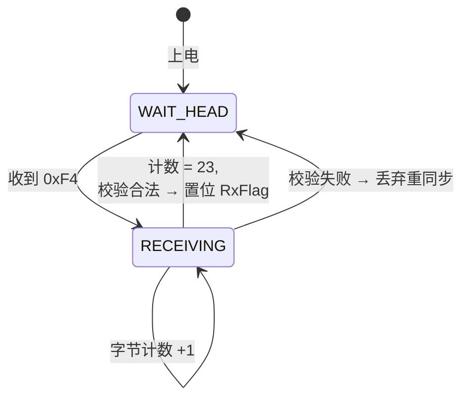

# LD2410B 协议解析说明

> 模组型号：海凌科 **LD2410B** —— 24GHz 毫米波人体存在感应雷达
> 用途：检测人体存在 / 运动 / 静止三种状态，输出距离与能量值
> 数据手册：[官方下载链接](https://www.hlktech.net/) （以厂商最新版为准）

---

## 一、模组基本信息

| 参数 | 取值 |
| --- | --- |
| 工作频段 | 24.0 ~ 24.25 GHz |
| 检测距离 | 0.75 ~ 6 m |
| 工作电压 | 5 V |
| 工作电流 | ≤ 80 mA |
| 接口 | UART（TTL，3.3 V 电平） |
| 默认波特率 | **256000 bps**，8N1 |
| 输出周期 | 100 ms 一帧 |

---

## 二、UART 工程报告输出帧格式（23 字节定长帧）

LD2410B 默认在"工程报告模式"下连续输出 23 字节定长帧，逐字节解析如下：

| 偏移 | 字段 | 长度 | 取值 | 说明 |
| --- | --- | --- | --- | --- |
| 0–3 | 帧头 | 4 B | `F4 F3 F2 F1` | 固定，用于同步 |
| 4–5 | 帧内数据长度 | 2 B | `0D 00` | 小端，固定 13 |
| 6 | 数据类型 | 1 B | `02` | 目标数据帧 |
| **7** | **目标状态** | 1 B | `00/01/02/03` | ★ **核心字段** |
| 8–9 | 运动目标距离 | 2 B | 小端 | 单位 cm |
| 10 | 运动目标能量 | 1 B | 0–100 | 数值越大目标越显著 |
| 11–12 | 静止目标距离 | 2 B | 小端 | 单位 cm |
| 13 | 静止目标能量 | 1 B | 0–100 | |
| 14–15 | 探测距离 | 2 B | 小端 | 单位 cm |
| 16 | 尾字节 | 1 B | `55` | |
| 17 | 校验字节 | 1 B | `00` | 厂商保留 |
| 18–21 | 帧尾 | 4 B | `F8 F7 F6 F5` | 固定 |
| 22 | (部分版本) | — | — | 不同固件版本可能略有差异 |

### 目标状态字节（偏移 7）的取值

| 取值 | 含义 |
| --- | --- |
| `0x00` | 无目标 |
| `0x01` | 仅运动目标 |
| `0x02` | 仅静止目标 |
| `0x03` | 运动 + 静止目标 |

**这就是答辩时我答"第七个字节对应状态信息"的依据。**

---

## 三、两状态机解析流程



### 状态定义

```c
typedef enum {
    LD2410_STATE_WAIT_HEAD,   // 等待帧头
    LD2410_STATE_RECEIVING    // 正在接收
} LD2410_State_t;
```

### 接收逻辑（伪代码）

```c
static LD2410_State_t s_state = LD2410_STATE_WAIT_HEAD;
static uint8_t  s_buf[23];
static uint8_t  s_idx = 0;
volatile uint8_t RxFlag = 0;

// USART1 中断（每字节进一次）
void USART1_IRQHandler(void)
{
    if (USART_GetITStatus(USART1, USART_IT_RXNE)) {
        uint8_t byte = USART_ReceiveData(USART1);

        switch (s_state) {
            case LD2410_STATE_WAIT_HEAD:
                if (byte == 0xF4) {
                    s_buf[0] = byte;
                    s_idx = 1;
                    s_state = LD2410_STATE_RECEIVING;
                }
                break;

            case LD2410_STATE_RECEIVING:
                s_buf[s_idx++] = byte;
                if (s_idx >= 23) {
                    s_state = LD2410_STATE_WAIT_HEAD;
                    RxFlag = 1;   // 通知主循环处理
                }
                break;
        }
    }
}
```

### 主循环消费

```c
void ProcessLD2410Frame(void)
{
    if (!RxFlag) return;
    RxFlag = 0;

    // ① 帧头/帧尾完整性校验
    if (s_buf[0]!=0xF4 || s_buf[1]!=0xF3 ||
        s_buf[18]!=0xF8 || s_buf[19]!=0xF7) {
        return;  // 误同步，丢弃
    }

    // ② 目标状态字节合法性校验（0x00 ~ 0x03）
    uint8_t target_state = s_buf[7];
    if (target_state > 0x03) {
        return;  // 脏数据
    }

    // ③ 解析有效字段
    uint16_t move_dist  = s_buf[8]  | (s_buf[9]  << 8);  // 小端
    uint8_t  move_energy = s_buf[10];
    uint16_t still_dist  = s_buf[11] | (s_buf[12] << 8);
    uint8_t  still_energy = s_buf[13];

    // ④ 上报给应用层
    Sedentary_OnTargetState(target_state);
    OLED_UpdatePresence(target_state, move_dist, still_dist);
}
```

---

## 四、关键设计要点

### 1. 为什么用两状态机而不是 if-else 一把梭？

**简单 if-else 写法**：
```c
if (byte == 0xF4 && next_byte == 0xF3 && ...) { ... }
```
问题：无法处理"字节流式到达"——UART 是一个字节一个字节进中断的，根本拿不到 `next_byte`。

**两状态机写法**：每次只处理一个字节，状态自动推进。这是处理字节流的标准做法。

### 2. 误同步保护

如果数据中途出现 `0xF4`，可能会误入接收状态。所以收完 23 字节后**必须验证帧尾**（`0xF8 F7 F6 F5`），不对就丢弃重新等帧头。

### 3. 目标状态合法性校验

LD2410B 规定状态字节只有 0x00–0x03 四种，我额外加了一道合法性检查：**任何不在这范围的值都视为脏帧丢弃**。这是面试时我说的"零脏数据"设计的体现之一。

### 4. 中断只负责"收字节进缓冲"

完整的协议解析（取字段、判合法、上报）放在主循环的 `ProcessLD2410Frame()` 里。**中断越短越好**，这是嵌入式黄金准则。

---

## 五、可能的踩坑点（已解决）

| 问题 | 现象 | 解决 |
| --- | --- | --- |
| 波特率配置错（用了 115200） | 一直收不到帧头 | 必须用 **256000 bps**，且 STM32 USART 要能精确分频出来 |
| 帧头匹配但帧尾不对 | 偶发解析错乱 | 增加帧尾验证 |
| 状态字节出现 0xFF 等异常值 | OLED 显示混乱 | 增加 0x00–0x03 合法性检查 |
| LD2410B 上电后前几帧异常 | 初始化时数据飘 | 上电后丢弃前 5 帧，等模组稳定 |

---

## 六、流程图（建议作图）

> 📷 **建议截图位置**：用 draw.io 画 LD2410B 解析完整流程图，包含中断和主循环两部分。
>
> 此处可放：
> 1. `images/ld2410b-frame-format.png` — 23 字节帧格式可视化
> 2. `images/ld2410b-state-machine.png` — 两状态机图
> 3. `images/ld2410b-debug.png` — 串口助手抓到的真实帧 hex 截图

---

## 七、调试技巧

1. **先用串口助手抓原始字节**——确认波特率对、帧头帧尾对，再写代码
2. **打印每帧的 hex** 到调试串口，对照协议手册逐字段验证
3. **故意人为进出检测区**，观察第 7 字节如何在 0x00/0x01/0x02/0x03 之间切换
4. **逻辑分析仪量电平**——确认 256000 bps 实际波特率正确，没有时钟漂移

---

## 八、参考

- 海凌科 LD2410B 通讯协议手册（厂商官方）
- STM32F103 USART 章节（参考手册 RM0008）
