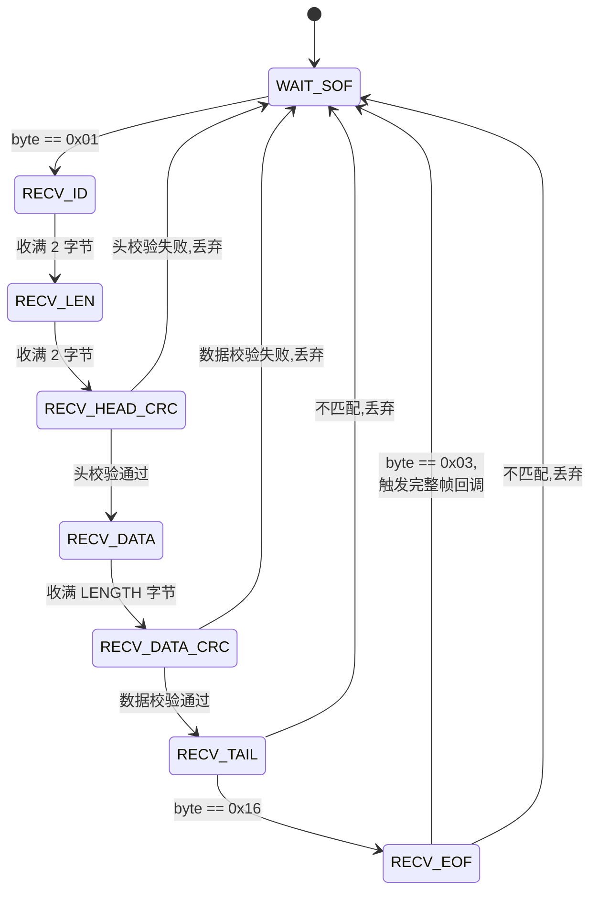

# LD6002 协议解析说明

> 模组型号：海凌科 **LD6002** —— 60GHz 毫米波呼吸心率雷达
> 用途：非接触式呼吸频率与心率监测
> 输出：呼吸率 (BPM) / 心率 (BPM) / 体动 / 距离 等多通道

---

## 一、模组基本信息

| 参数 | 取值 |
| --- | --- |
| 工作频段 | 60 GHz |
| 检测距离 | 0.3 ~ 1.5 m（呼吸） |
| 工作电压 | 5 V，对电源纹波**极其敏感** |
| 接口 | UART (TTL，3.3 V) |
| 默认波特率 | **1382400 bps** —— 非标，需 MCU 精确分频 |
| 输出周期 | 约 50–100 ms 一帧（取决于配置） |
| 帧格式 | **变长帧** + 双重 8 位累加和校验 |

⚠️ **关键供电细节**：LD6002 对电源纹波敏感，本项目采用**独立低纹波 LDO 供电**，避免与 STM32 共用电源导致呼吸相位信号被噪声淹没。

---

## 二、变长帧格式

```
┌────────┬────────┬────────────┬───────┬───────────┬───────────┬───────┬────────┐
│  SOF   │   ID   │  LENGTH    │ HEAD  │   DATA    │   DATA    │  TAIL │  EOF   │
│  1 B   │  2 B   │   2 B(LE)  │ CRC   │  N bytes  │   CRC     │  1 B  │  1 B   │
│        │        │            │ 1 B   │           │   1 B     │       │        │
└────────┴────────┴────────────┴───────┴───────────┴───────────┴───────┴────────┘
   0x01    类型      载荷长度     头校验    实际数据     数据校验    0x16    0x03
```

### 字段说明

| 字段 | 长度 | 说明 |
| --- | --- | --- |
| SOF (Start Of Frame) | 1 B | 固定 `0x01`，帧起始标志 |
| ID | 2 B | 数据类型/通道号，如呼吸/心率/体动 |
| LENGTH | 2 B | 载荷长度（小端） |
| **HEAD_CRC** | 1 B | ★ **前几个字段的 8 位累加和**（防止误同步） |
| DATA | N B | 载荷，取决于 ID 类型，常为 IEEE-754 浮点 |
| **DATA_CRC** | 1 B | ★ **DATA 部分的 8 位累加和** |
| TAIL | 1 B | 固定 `0x16` |
| EOF | 1 B | 固定 `0x03` |

> 注：上述格式为本项目实际实现的简化版描述。**以厂商官方协议手册为准**，不同固件版本字段顺序可能略有差异。

### IEEE-754 小端浮点数据示例

ID 表示"呼吸频率"时，DATA 为 4 字节小端浮点，例如：
```
原始字节:    00 00 7C 41
组合(小端):  0x417C0000
IEEE-754:    15.75 bpm
```

---

## 三、9 状态机解析流程



### 状态定义

```c
typedef enum {
    L6_WAIT_SOF,        // 等待 0x01
    L6_RECV_ID,         // 收 ID (2 B)
    L6_RECV_LEN,        // 收 LENGTH (2 B)
    L6_RECV_HEAD_CRC,   // 收 头校验 (1 B)
    L6_RECV_DATA,       // 收 DATA (N B)
    L6_RECV_DATA_CRC,   // 收 数据校验 (1 B)
    L6_RECV_TAIL,       // 等 0x16
    L6_RECV_EOF,        // 等 0x03
    L6_FRAME_READY      // (虚状态) 帧完成
} LD6002_State_t;
```

### 解析逻辑（核心代码）

```c
static LD6002_State_t s_state = L6_WAIT_SOF;
static uint16_t s_id, s_length, s_data_idx;
static uint8_t  s_data[256];
static uint8_t  s_head_sum, s_data_sum;

void LD6002_ProcessByte(uint8_t byte)
{
    switch (s_state) {
        case L6_WAIT_SOF:
            if (byte == 0x01) {
                s_head_sum = byte;
                s_state = L6_RECV_ID;
                // ... 初始化计数
            }
            break;

        case L6_RECV_ID:
            s_id = (s_id << 8) | byte;
            s_head_sum += byte;
            // 收满 2 B 后切到 RECV_LEN
            break;

        case L6_RECV_LEN:
            s_length = byte | (next_byte << 8);  // 小端
            s_head_sum += byte;
            break;

        case L6_RECV_HEAD_CRC:
            if (byte != s_head_sum) {
                s_state = L6_WAIT_SOF;  // 校验失败,重同步
                return;
            }
            s_data_sum = 0;
            s_data_idx = 0;
            s_state = L6_RECV_DATA;
            break;

        case L6_RECV_DATA:
            s_data[s_data_idx++] = byte;
            s_data_sum += byte;
            if (s_data_idx >= s_length) {
                s_state = L6_RECV_DATA_CRC;
            }
            break;

        case L6_RECV_DATA_CRC:
            if (byte != s_data_sum) {
                s_state = L6_WAIT_SOF;  // 数据校验失败
                return;
            }
            s_state = L6_RECV_TAIL;
            break;

        case L6_RECV_TAIL:
            if (byte == 0x16) s_state = L6_RECV_EOF;
            else              s_state = L6_WAIT_SOF;
            break;

        case L6_RECV_EOF:
            if (byte == 0x03) {
                // ✅ 完整帧到手,触发回调
                LD6002_OnFrameComplete(s_id, s_data, s_length);
            }
            s_state = L6_WAIT_SOF;
            break;
    }
}
```

---

## 四、IEEE-754 小端浮点解析（核心技巧）

LD6002 输出的浮点数据为 **IEEE-754 单精度小端**，STM32F103 也是小端架构，**字节序天然一致**。

### 错误做法：手动位运算

```c
// ❌ 复杂、易错
uint32_t bits = data[0] | (data[1]<<8) | (data[2]<<16) | (data[3]<<24);
float value = *(float*)&bits;  // 强转,有别名违例风险
```

### 正确做法：union 联合体

```c
// ✅ 简洁、安全、零开销
typedef union {
    uint8_t  bytes[4];
    float    value;
} FloatUnion_t;

float bytes_to_float_le(const uint8_t *buf)
{
    FloatUnion_t u;
    u.bytes[0] = buf[0];
    u.bytes[1] = buf[1];
    u.bytes[2] = buf[2];
    u.bytes[3] = buf[3];
    return u.value;
}
```

**面试讲解要点**：
- LD6002 是小端，STM32 是小端，**字节序相同所以直接映射**
- union 把同一块内存"既看作 4 字节数组、又看作 float"，赋值字节即得到 float
- 如果未来移植到大端 MCU（如某些 PowerPC），需要逆序：`u.bytes[0]=buf[3]; ...; u.bytes[3]=buf[0]`

---

## 五、关键设计要点

### 1. 为什么用 9 状态机？

LD6002 是**变长帧**，不能像 LD2410B 那样简单数 23 个字节。9 状态机一步步推进，每一步验证一次，**任何位置出错都能立刻重同步到 SOF**，不会污染后续数据。

### 2. 双重校验和的作用

- **头校验**：保护 SOF + ID + LENGTH 字段。如果误同步到 0x01，头校验大概率失败，立刻重同步，**不会浪费时间读完整个错误帧**
- **数据校验**：保护载荷。任何传输误码都会被检出

### 3. 1382400 bps 非标波特率怎么搞定的？

STM32 USART 的波特率寄存器 BRR 是分数分频：
```
USARTDIV = APBx_CLK / (16 × baud_rate)
```
对于 USART1 (APB2 = 72 MHz)、baud = 1382400：
```
USARTDIV = 72_000_000 / (16 × 1_382_400) ≈ 3.255
```
能精确表示，所以实际波特率误差 < 0.5%，没问题。

**如果你换更低主频的 MCU（如 48 MHz F103），可能就分不出来这个波特率，会丢字节。** 这也是选 72 MHz 主频的隐性收益。

### 4. 高波特率下不丢字节的关键

- **中断只做"存字节 + 喂状态机"**，不做任何耗时操作
- 配合**环形缓冲区**，主循环慢一点也不影响
- USART RX 中断使能时**不能 disable 全局中断超过 8 字节时间**（约 60 µs），否则会硬件 overrun

---

## 六、错误处理矩阵

| 错误位置 | 处理动作 | 副作用 |
| --- | --- | --- |
| SOF 不是 0x01 | 继续等下一字节 | 无 |
| 头校验失败 | 直接重置到 WAIT_SOF | 当前帧丢弃 |
| 数据校验失败 | 重置到 WAIT_SOF | 当前帧丢弃 |
| TAIL 不是 0x16 | 重置到 WAIT_SOF | 当前帧丢弃 |
| EOF 不是 0x03 | 重置到 WAIT_SOF | 当前帧丢弃 |
| LENGTH 超过缓冲区 256 字节 | 重置到 WAIT_SOF | 当前帧丢弃 |

**所有错误路径都走"重置到 WAIT_SOF"**，简单粗暴但有效。

---

## 七、流程图（建议作图）

> 📷 **建议截图位置**：可以放：
>
> 1. `images/ld6002-frame-format.png` — 变长帧格式图（彩色版）
> 2. `images/ld6002-state-machine.png` — 9 状态机彩色版
> 3. `images/ld6002-power-design.png` — 独立 LDO 电源设计原理图
> 4. `images/ld6002-real-frame.png` — 串口抓到的真实变长帧 hex

---

## 八、调试技巧

1. **波特率优先确认**：用逻辑分析仪测出实际波特率，确认 1382400 bps 误差 < 1%
2. **校验和算法验证**：先用 Python 脚本在 PC 端解析厂商示例数据，确认校验算法对，再写嵌入式版本
3. **故意制造校验失败**：手动修改一字节后注入，验证状态机能正确丢弃并重同步
4. **观察呼吸数据稳定性**：人静坐时呼吸率应该缓慢变化在 12–20 bpm 之间，跳动剧烈说明有噪声

---

## 九、参考

- 海凌科 LD6002 通讯协议手册（厂商官方）
- IEEE 754-2019 浮点格式标准
- STM32F103 USART 章节（参考手册 RM0008）
